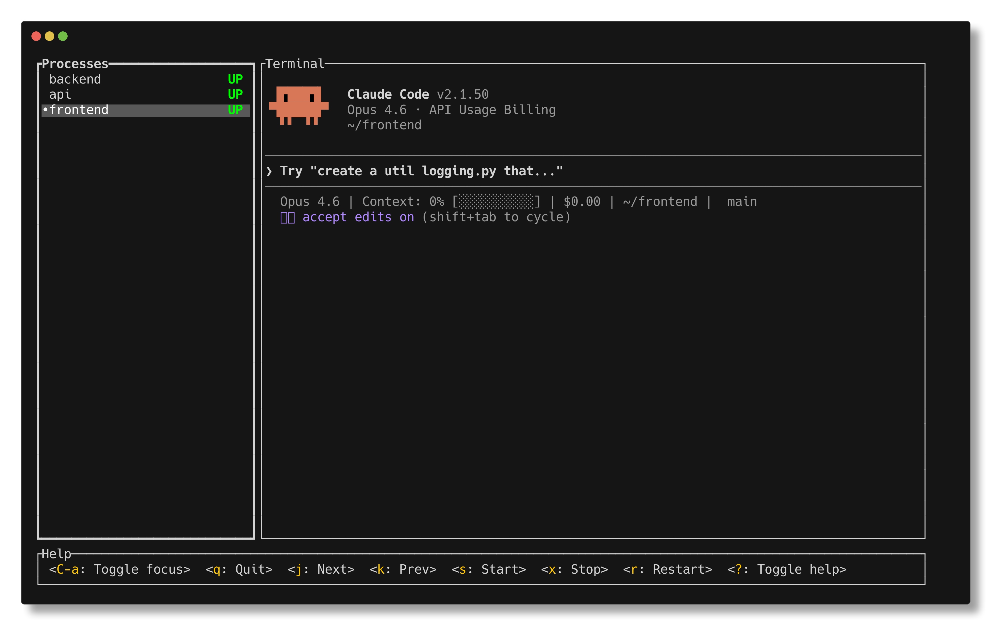

# claude-mprocs

Run multiple [Claude Code](https://docs.anthropic.com/en/docs/claude-code) instances in parallel using [mprocs](https://github.com/pvolok/mprocs) inside a persistent [tmux](https://github.com/tmux/tmux) session.



## Prerequisites

- [Claude Code](https://docs.anthropic.com/en/docs/claude-code) (`claude` CLI)
- [tmux](https://github.com/tmux/tmux) (`brew install tmux`)
- [mprocs](https://github.com/pvolok/mprocs) (`brew install mprocs`)

## Install

```bash
git clone https://github.com/matanshavit/claude-mprocs ~/.config/claude-mprocs
~/.config/claude-mprocs/claude-mprocs install
```

Then restart your shell (or `source ~/.zshrc`).

You can also clone to any other directory — the install command adds wherever it lives to your PATH.

## Quick start

```bash
# Start a session with one Claude instance in ~/dev
cm s main:~/dev

# Auto-attach to the tmux session immediately
cm s main:~/dev -a

# Start multiple instances
cm s main:~/dev fe:~/dev/frontend api:~/dev/backend

# Add another instance to a running session
cm add docs ~/dev/docs

# Attach to the session
cm a

# Stop everything
cm q
```

## Commands

| Command | Short | Description |
|---|---|---|
| `cm start [name:dir ..]` | `cm s` | Start mprocs in a tmux session |
| `cm attach` | `cm a` | Attach to the tmux session |
| `cm add <name> [dir]` | | Add a Claude instance to running mprocs |
| `cm remove <index>` | `cm rm` | Kill a process by index (0-based) |
| `cm status` | `cm st` | Show if the session is running |
| `cm stop` | `cm q` | Stop the session and all instances |
| `cm restart [name:dir ..]` | `cm r` | Stop and start with a new config |
| `cm clean` | | Kill orphans, remove temp files |
| `cm config` | | Open mprocs.yaml in your editor |
| `cm ctl <yaml>` | | Send a raw mprocs remote control command |
| `cm install` | | Add scripts to your PATH |

### Flags

- **`-y`** — Start Claude with `--dangerously-skip-permissions` (bypass permissions mode)
  - Works with `start`, `add`
  - `cm s main:~/dev -y` — all instances bypass permissions
  - `cm add task ~/dev/project -y` — just this instance
- **`-a`** — Auto-attach to the tmux session after starting
  - `cm s main:~/dev -a`

## Adding instances inside mprocs

When you're attached to the mprocs TUI, press **`a`** to add a new process. Type:

```
cl ~/dev/project
```

Or with bypass permissions:

```
cly ~/dev/project
```

These are small launcher scripts installed alongside `claude-mprocs`:

| Command | Description |
|---|---|
| `cl [dir]` | Launch Claude Code in a directory |
| `cl -y [dir]` | Launch with `--dangerously-skip-permissions` |
| `cly [dir]` | Same as `cl -y` |

## How it works

- **tmux** keeps the session alive when you disconnect
- **mprocs** provides a TUI to manage multiple processes with separate terminals
- **Claude Code** instances run as separate processes inside mprocs
- The mprocs [remote control server](https://github.com/pvolok/mprocs#remote-control) (port 4050) enables `cm add` and `cm ctl` to manage processes without attaching

### The CLAUDECODE environment variable

Claude Code sets `CLAUDECODE=1` in its environment, which prevents launching nested instances. When `cm start` is invoked from within a Claude Code session, it temporarily clears this variable from the tmux environment so child processes can launch Claude Code independently.

## Recommended tmux settings

Add these to your `~/.tmux.conf` for a better experience:

```bash
# Enable mouse scrolling, pane selection, and window resizing
set -g mouse on

# Enable extended key sequences (better key handling in apps like vim/neovim)
set -s extended-keys on

# Enable OSC 52 clipboard integration
set -g set-clipboard on

# Increase scrollback buffer (default 2000 is low for Claude output)
set -g history-limit 50000

# Remove delay after pressing Escape (important for vim/neovim)
set -sg escape-time 0

# Let programs detect focus gain/loss
set -g focus-events on

# Proper 256-color support
set -g default-terminal "tmux-256color"
```

- **`mouse on`** — lets you scroll through Claude output history, click to select panes, and drag to resize them — all without keyboard shortcuts
- **`extended-keys on`** — ensures modifier key combinations (e.g. `Ctrl+Shift+...`) are passed through correctly to programs running inside tmux
- **`set-clipboard on`** — allows programs inside tmux to copy to your system clipboard via OSC 52
- **`history-limit 50000`** — increases scrollback buffer from the default 2000 lines, which fills up fast with Claude output
- **`escape-time 0`** — removes the delay after pressing Escape, important for vim/neovim users
- **`focus-events on`** — lets programs like vim detect when they gain/lose focus inside tmux
- **`default-terminal "tmux-256color"`** — ensures proper 256-color support and fixes color issues in some tools

## Troubleshooting

**"Session already running"** — Run `cm q` to stop the existing session, or `cm a` to attach to it.

**Orphaned mprocs process** — If mprocs survives after tmux dies, `cm clean` will find and kill it. The `cm start` command also auto-cleans orphans before starting.

**Port 4050 in use** — The mprocs remote control server listens on `127.0.0.1:4050`. If something else is using that port, edit the `SERVER` variable at the top of the `claude-mprocs` script.

## License

MIT
